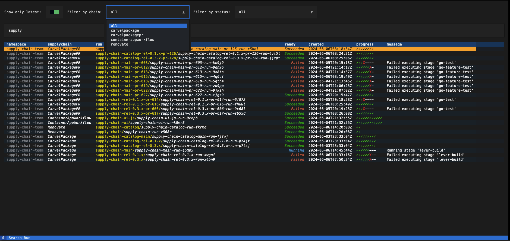

# sup
`sup` is an interactive CLI for Tanzu Supply chains.

## Getting Started
### Install sup
#### Prerequisites
- Install the latest Python 3.10.x from [python.org](https://www.python.org/downloads/)

Recommended way to install tappr is by using [pipx](https://pypa.github.io/pipx/#install-pipx).
You can `brew` install `pipx` as follows:

```bash
brew install pipx
pipx ensurepath
```
To Install latest:
```
pipx install git+https://github.com/atmandhol/sup.git
```

If you already have `sup` installed from latest, and want to pull in the new changes:
```
pipx reinstall sup
```

- Run `sup` on your command line to confirm if its installed.



## Setup for Local

* Install `poetry` on the system level using 
```
pip3 install poetry
```
* Create a virtualenv `tappr` using virtualenvwrapper and run install
```
mkvirtualenv sup -p python3
poetry install
```

* Run locally
```
textual run sup/main.py
```

### Build
Run the following poetry command
```bash
$ poetry build
```
This will generate a dist folder with a whl file and a tar.gz file.

### Upgrade dependencies
Run the following poetry command
```bash
$ poetry update
```
